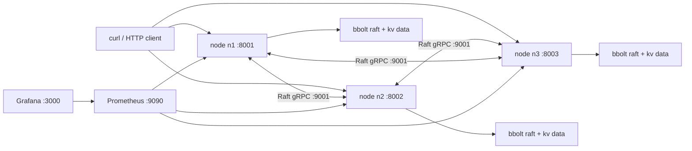

# Raft KV Store

A distributed key-value store written from scratch in Go. It implements Raft leader election, log replication, committed state-machine application, persistent node storage, an HTTP KV API, and a Docker Compose demo with Prometheus and Grafana.

This is a learning and portfolio project: the goal is to make the consensus mechanics visible rather than hide them behind a production Raft library.

## What It Does

- Elects and re-elects leaders across a 3-node Raft cluster
- Replicates log entries with `AppendEntries`
- Commits entries after majority replication
- Applies committed commands to a bbolt-backed KV state machine
- Serves `PUT`, `GET`, and `DELETE` through HTTP
- Forwards follower writes to the current leader when known
- Exposes Prometheus metrics and a provisioned Grafana dashboard
- Includes deterministic failure-mode tests and a local process smoke test



## Quick Start

Start a 3-node cluster with Prometheus and Grafana:

```sh
docker compose up --build
```

Write through any node. If the node is a follower, it forwards to the known leader after heartbeats identify one:

```sh
curl -X PUT --data-binary raft http://127.0.0.1:8001/kv/name
curl http://127.0.0.1:8002/kv/name
curl -X DELETE http://127.0.0.1:8003/kv/name
```

Open:

- Grafana: <http://127.0.0.1:3000>
- Prometheus: <http://127.0.0.1:9090>
- Node metrics: <http://127.0.0.1:8001/metrics>

Stop the stack:

```sh
docker compose down
```

## Demo Flow

1. Start the stack with `docker compose up --build`.
2. Watch node logs until one node prints `state=leader`.
3. Write a key through any node and read it from another node.
4. Stop the leader container with `docker compose stop n1` or whichever node is leader.
5. Watch the remaining nodes elect a new leader.
6. Write another key through the remaining cluster.
7. Open Grafana and show term, commit index, request traffic, elections, and replication latency.

See [docs/demo-script.md](docs/demo-script.md) for a tighter 2-minute walkthrough.

## HTTP API

```sh
curl -X PUT --data-binary value http://127.0.0.1:8001/kv/my-key
curl http://127.0.0.1:8002/kv/my-key
curl -X DELETE http://127.0.0.1:8003/kv/my-key
```

Successful writes return `204 No Content`. Missing keys return `404 Not Found`. Writes that cannot reach a leader return a non-2xx response.

## Metrics

Each node exposes `/metrics` with:

- `raft_leader_elections_total`
- `raft_log_replication_latency_seconds`
- `raft_commit_index`
- `raft_term_current`
- `kv_requests_total`

Grafana is provisioned with a `Raft KV Cluster` dashboard from [deploy/grafana/dashboards/raft-kv.json](deploy/grafana/dashboards/raft-kv.json).

## Local Development

Run tests:

```sh
go test ./...
```

Run the process smoke test:

```sh
scripts/smoke-cluster.sh
```

Generate protobuf stubs:

```sh
make proto
```

Run three local nodes without Docker:

```sh
go run ./cmd/node --id n1 --raft-addr 127.0.0.1:9001 --http-addr 127.0.0.1:8001 --peers n2=127.0.0.1:9002,n3=127.0.0.1:9003 --peer-http n2=http://127.0.0.1:8002,n3=http://127.0.0.1:8003 --data data/n1.db --kv-data data/n1-kv.db
go run ./cmd/node --id n2 --raft-addr 127.0.0.1:9002 --http-addr 127.0.0.1:8002 --peers n1=127.0.0.1:9001,n3=127.0.0.1:9003 --peer-http n1=http://127.0.0.1:8001,n3=http://127.0.0.1:8003 --data data/n2.db --kv-data data/n2-kv.db
go run ./cmd/node --id n3 --raft-addr 127.0.0.1:9003 --http-addr 127.0.0.1:8003 --peers n1=127.0.0.1:9001,n2=127.0.0.1:9002 --peer-http n1=http://127.0.0.1:8001,n2=http://127.0.0.1:8002 --data data/n3.db --kv-data data/n3-kv.db
```

## Project Layout

- [cmd/node](cmd/node): node entrypoint and process wiring
- [raft](raft): Raft state, elections, replication, proposals, and tests
- [raftgrpc](raftgrpc): gRPC transport adapter
- [client](client): HTTP KV API
- [store](store): bbolt-backed Raft storage and KV state machine
- [observability](observability): Prometheus metrics wiring
- [deploy](deploy): Prometheus and Grafana configuration
- [docs](docs): architecture, demo, and chaos-testing notes

## Design Notes

More detail is in [docs/architecture.md](docs/architecture.md). The short version:

- Persistent Raft state is stored in bbolt.
- Raft-to-Raft traffic uses gRPC/protobuf.
- Client writes go through the leader and wait for commit.
- Committed commands are applied in log order to the KV state machine.
- Reads currently come from each node's local committed state.

## Current Limits

This is intentionally not a production database yet. The next major improvements would be:

- Snapshotting and log compaction
- Dynamic membership changes
- Linearizable read path, such as ReadIndex or leader leases
- Stronger process-level chaos harness for Docker networks
- Auth, TLS, request tracing, and client SDK ergonomics
