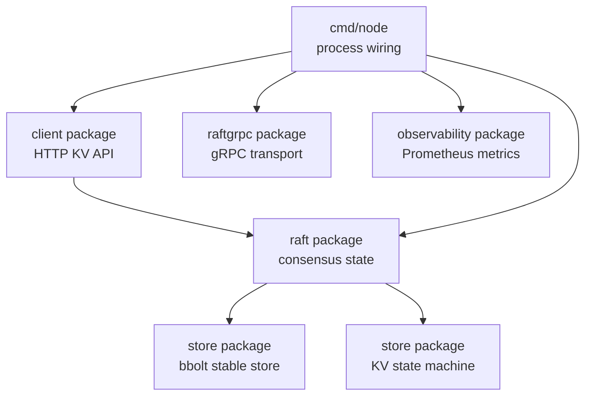

# Architecture

Raft KV Store is split into a small set of packages so the consensus algorithm stays separate from process wiring, transport, storage, and observability.

## Components

## Node Process

Each `cmd/node` process owns:

- one `raft.RaftNode`
- a bbolt-backed Raft stable store
- a bbolt-backed KV state machine
- a gRPC server for Raft RPCs
- a gRPC client set for peers
- an HTTP API for client reads and writes
- a Prometheus `/metrics` endpoint

The node starts an election timer, a heartbeat loop, and an apply loop. The election timer and heartbeat loop drive Raft progress. The apply loop wakes from a commit-ready signal and applies committed log entries to the KV state machine without waiting on a polling interval.

## Raft State

The core state lives in `raft.RaftNode`:

- `state`: follower, candidate, or leader
- `currentTerm`
- `votedFor`
- `log`
- `commitIndex`
- `lastApplied`
- `leaderID`
- leader-only `nextIndex` and `matchIndex`

`currentTerm`, `votedFor`, and `log` are persisted through the `StableStore` interface. This project uses bbolt for the concrete implementation.

## RPCs

The protobuf service defines three Raft RPCs:

- `PreVote`
- `RequestVote`
- `AppendEntries`

`raftgrpc` adapts generated protobuf structs into the internal Raft request and response types. This keeps generated transport code out of the consensus package.

## Elections

Before incrementing its term, a node sends `PreVote` requests for the next possible term. If it cannot get a majority of pre-votes, it stays follower and leaves its term unchanged. This prevents an isolated node from repeatedly increasing its term and later forcing a healthy leader to step down when the partition heals.

After pre-vote succeeds, the node becomes candidate, increments its term, votes for itself, and sends `RequestVote` to peers. Vote RPCs are sent concurrently so a slow peer does not block progress to the rest of the cluster.

## Replication

Leaders send `AppendEntries` requests to peers concurrently. The public `ReplicateOnce` path waits for the peer batch to finish, which is useful for heartbeats and tests. Proposal replication can return as soon as the proposed entry reaches majority commit, leaving slower followers to catch up on later heartbeats.

## Writes

1. A client sends `PUT /kv/{key}` or `DELETE /kv/{key}`.
2. If the receiving node is a follower and knows the leader, it forwards the write.
3. The leader appends the command to its local log.
4. The leader sends concurrent `AppendEntries` calls to followers.
5. Once a majority has replicated the entry, the leader advances `commitIndex`.
6. The commit-ready signal wakes the apply loop.
7. The HTTP request returns after the proposal commits and the local state machine applies it.

## Reads

`GET /kv/{key}` reads from the receiving node's local committed state. This is simple and useful for demos, but it is not a fully linearizable read protocol. A production Raft KV store should add ReadIndex, leader leases, or route reads through the leader with a quorum check.

## Raft Guarantees

### Election Safety

Each node persists one `votedFor` value per term and rejects second votes in the same term. A candidate becomes leader only after receiving a majority. Since majorities overlap, at most one leader can be elected for a term. Pre-vote reduces disruptive elections by checking majority reachability before a node increments its term.

### Leader Append-Only

Leaders append new commands to their own logs through local append logic. They do not overwrite entries in their own log after becoming leader. Conflicting-entry truncation is handled on followers during `AppendEntries`.

### Log Matching

`AppendEntries` includes `prevLogIndex` and `prevLogTerm`. Followers reject appends that do not match their local log at that position. If the prefix matches, followers truncate conflicting suffix entries before appending new entries.

### Leader Completeness

Candidates include their last log index and term in `RequestVote`. Voters grant votes only when the candidate log is at least as up to date as their own. Combined with majority commit rules, this prevents a leader without committed entries from winning a later term.

### State Machine Safety

Entries are applied only after they are committed, and each node tracks `lastApplied` so entries are applied in log order at most once. The KV state machine receives committed Raft log entries, decodes commands, and updates bbolt-backed state.

## Observability

Each node exposes:

- `raft_leader_elections_total`
- `raft_log_replication_latency_seconds`
- `raft_commit_index`
- `raft_term_current`
- `kv_requests_total`

The Docker Compose demo provisions Prometheus to scrape all nodes and Grafana to show cluster health.

## Tradeoffs

- Static membership keeps the implementation focused on core Raft.
- No snapshots yet, so logs grow forever.
- Reads are local committed reads, not linearizable reads.
- The failure tests are mostly deterministic in-memory tests, with a process smoke test for the binary path.
- gRPC transport is intentionally thin so tests can exercise Raft behavior directly.

## Next Improvements

- Snapshotting and log compaction
- Dynamic cluster membership
- Linearizable reads
- More Docker-based network partition tests
- Structured logging and distributed tracing
- Client library with retry and leader discovery
